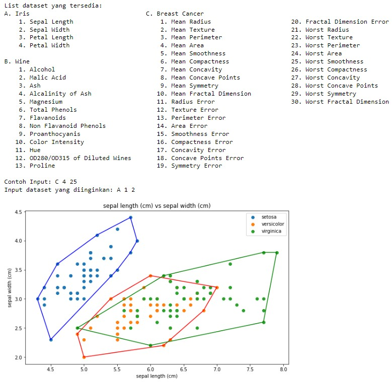

# Tugas Kecil 2 IF2211 Strategi Algoritma

> Membuat implementasi convex hull untuk visualisasi tes linear separability dataset dengan algoritma divide and conquer

## Requirement Program
* Python 3.9.7
    * certifi 2021.10.8
    * charset-normalizer 2.0.12
    * cycler 0.11.0
    * fonttools 4.29.1
    * idna 3.3
    * joblib 1.1.0
    * kiwisolver 1.3.2
    * matplotlib 3.5.1
    * numpy 1.22.2
    * packaging 21.3
    * pandas 1.4.1
    * Pillow 9.0.1
    * pyparsing 3.0.7
    * python-dateutil 2.8.2
    * pytz 2021.3
    * requests 2.27.1
    * scikit-learn 1.0.2
    * scipy 1.8.0
    * six 1.16.0
    * sklearn 0.0
    * threadpoolctl 3.1.0
    * urllib3 1.26.8

## Cara Memakai

### Jupyter
1. Download atau clone repo ini
2. Buka folder src repo ini
3. Buka file main.ipynb


### Terminal

1. Download atau clone repo ini
2. Jalankan Windows PowerShell
3. Buka folder src repo ini
4. Buat Virtual Environment Python

    ```bash
    py -m venv venv
    ./venv/Scripts/Activate.ps1
    ```

5. Install library yang akan digunakan

    ```bash
    pip3 install -r requirements.txt
    ```

6. Pastikan library yang telah diinstall sudah sesuai

    ```bash
    pip freeze
    ```

7. Jalankan program

    ```bash
    py main.py
    ```

## Tampilan Cara Set-Up Virtual Environtment dan Download Library pada Windows PowerShell


<br/>

## Tampilan Hasil Convex Hull untuk Dataset Iris pada Jupyter



<br/>

## Tampilan Hasil Convex Hull untuk Dataset Iris pada Terminal


<br/>

## Identitas Pembuat

Steven - 13520131

<br/>

## Referensi
1. https://informatika.stei.itb.ac.id/~rinaldi.munir/Stmik/2021-2022/Algoritma-Divide-and-Conquer-(2022)-Bagian4.pdf
2. https://www.geeksforgeeks.org/check-if-two-given-line-segments-intersect/
3. https://www.geeksforgeeks.org/convex-hull-set-1-jarviss-algorithm-or-wrapping/
4. https://www.geeksforgeeks.org/convex-hull-monotone-chain-algorithm/